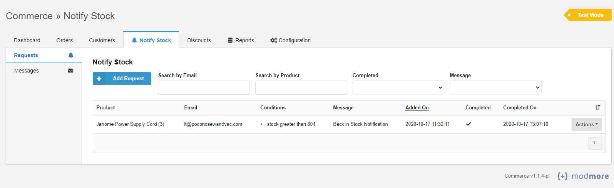
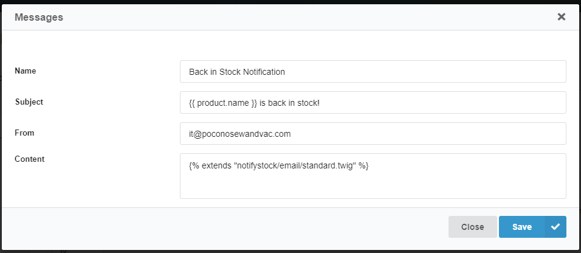
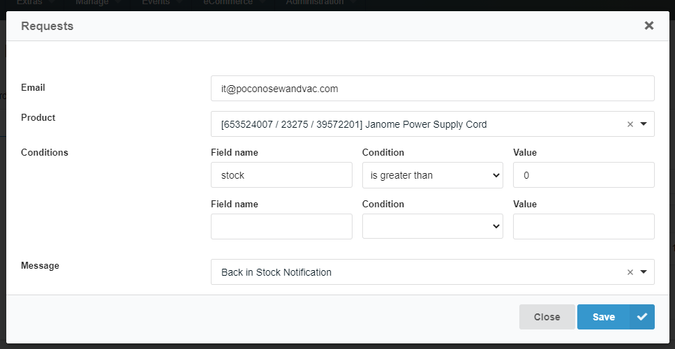

# Commerce Notify Request

Allow customers or merchants to receive an email notification when any product field changes to meet a condition.

Comes with a FormIt hook for customers to add a product to receive a notification for or notify requests can also be added in an admin UI.



## Use Cases

A few example use cases this module can be used for to send an email:

- A product is back in stock
- A product only has X stock or less remaining
- A product price has dropped below X amount

## Setup

### Installing the Module

1. Download & install the package from the MODX Extras repository or from the Github releases.
2. Enable the module under Extras -> Commerce -> Configuration -> Modules. After enabling, refresh the page. You should see a new "Notify Stock" tab in the admin dashboard.

### Setting up the Cron

**This module requires a cronjob to be setup to send notification emails**. Create a new entry in your crontab pointing to the run.php file under assets/components/commerce_notifystock/run.php.

Example cron entry checking for product updates every hour:

```
0 * * * * /usr/bin/php /var/www/html/assets/components/commerce_notifystock/run.php > /dev/null 2>&1
```

**Make sure to replace /var/www/html with the actual path of your web root.**

#### Securing the Cronjob

By default, the cronjob is allowed to run via a web request (to enable the usage of web-based cron services). It is recommended to disable web access for security by changing the following system setting in MODX to "No": `commerce_notifystock.web_cron`. This will prevent requests from the web from running the script to send notify request emails.

### Creating a Message to Send

Before any notify requests can be sent, a message needs to be created under Notify Stock -> Messages. This message contains the email metadata that is used when a notify request runs. Click "Add Message" to add a new message.



- **Name**: Can be anything, used as a reference
- **Subject**: The email subject. All email placeholders are available here (see all available placeholders in the default standard.twig email template).
- **From**: The from email address.
- **Content**: Content of the email to send. This can refer to a Twig template. By default, this module comes with an example template that can be used:

Example template:
```twig

``` 

You can create new email templates in your own custom theme under the notifystock/email folder and refer to it here.

### Creating a Notify Request in the Admin

A notify request can be created within the admin UI under Notify Stock -> Requests. You can also search and edit previous requests here.



- **Email**: Customer/merchants email. Notification email will be sent to this address.
- **Product**: Product that will be checked.
- **Conditions**: Product conditions that need to be met to send the email. You can add as many conditions as needed.
- **Message**: The message template to use for the email.

The notify request will be checked during each cron run to see if it meets the conditions set. If it does, it will send an email then remove the notify request.

**Note that all monetary values in conditions are in cents!** 

### Creating a Notify Request on the Frontend

This module comes with a FormIt hook, commerce_notifystock.add_request_hook, which allows adding a form to the frontend to add a notify request for a product.

**You must pass in JSON encoded conditions and the message ID to the FormIt call.**

**Example Usage**:

```html
[[!FormIt?
    &hooks=`commerce_notifystock.add_request_hook`
    &validate=`email:required,product:required`
    &conditions=`[{"field":"stock","condition":"greater than","value":"0"}]`
    &submitVar=`notify-form`
    &message=`1`
]]

<form id="notify-form" action="[[~[[*id]]]]" method="POST">
    [[!+modx.user.id:userinfo=`email`:notempty=`
        <input type="hidden" name="email" value="[[!+modx.user.id:userinfo=`email`]]">`
    :empty=`
        <label for="notify-stock-form-email">Email Address</label>
        <input type="email" name="email" placeholder="Enter email address">
    `]]
    
    <!-- Product ID should be added to the value -->
    <input type="hidden" name="product" value="PRODUCT_ID_HERE">
         
    <input type="submit" name="notify-form" value="Submit">
</form>
```

## License

[MIT](https://github.com/poconosewandvac/Commerce_NotifyStock/blob/master/core/components/commerce_notifystock/docs/license.txt)
